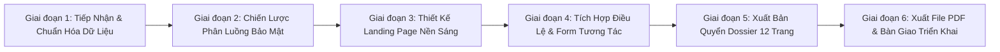

# QUY TRÌNH CHUẨN (SOP): THIẾT KẾ LANDING PAGE & HỒ SƠ TÀI TRỢ SỰ KIỆN ĐỈNH CAO
**Đơn vị áp dụng**: Ban Sự kiện & Chuyên đề, Ban Biên Tập Báo Lao Động  
**Mục đích**: Chuẩn hóa toàn diện quy trình từ khâu tiếp nhận kế hoạch, xử lý dữ liệu, thiết kế giao diện số, xuất bản hồ sơ tài trợ đến bàn giao truyền thông.

---

## 🧭 KHUNG QUY TRÌNH 6 BƯỚC (6-PHASE MASTER FRAMEWORK)

---

### 🔹 GIAI ĐOẠN 1: TIẾP NHẬN & ĐỐI SOÁT DỮ LIỆU ĐẦU VÀO
1. **Thu thập trọn bộ hồ sơ pháp lý & chuyên môn**:
   - Bản Kế hoạch tổ chức sự kiện được phê duyệt mới nhất (Thời gian, địa điểm, mục đích).
   - Bản Điều lệ thi đấu / Quy chế tham dự (Các điều khoản, bảng đấu, giải thưởng, khiếu nại).
   - Thư mời tài trợ và Bản phân bổ quyền lợi nhà tài trợ (Ma trận 06 cấp gói tài trợ).
2. **Kiểm tra tính nhất quán (Fact-Checking)**:
   - Thống nhất ngày tổ chức dự kiến, địa điểm chính thức.
   - Xác định đúng cơ quan chủ trì, ban tổ chức, hotline chuyên môn & đối ngoại.
   - Loại bỏ các thông tin chưa phê duyệt hoặc không thuộc phạm vi kế hoạch mới.

---

### 🔹 GIAI ĐOẠN 2: CHIẾN LƯỢC PHÂN LUỒNG & BẢO MẬT QUYỀN LỢI (DOSSIER SEPARATION)
1. **Phân tách 2 luồng tiếp cận**:
   - **Luồng 1 (Public Landing Page - Đại chúng & Golfer/Người tham dự)**: Giới thiệu ý nghĩa, lịch trình, bảng đấu, điều lệ, hình ảnh và form đăng ký tham gia.
   - **Luồng 2 (Confidential Dossier - Dành riêng Doanh nghiệp & Nhà tài trợ)**: Giới thiệu 07 Điểm chạm thương hiệu, ma trận quyền lợi 06 cấp gói tài trợ và tư vấn độc quyền 1:1.
2. **Nguyên tắc bảo mật giá trị tài trợ**:
   - **TUYỆT ĐỐI KHÔNG** công khai bảng giá hoặc ma trận chi tiết các gói tài trợ lên Landing Page đại chúng.
   - Sử dụng nút CTA *"Đăng ký nhận Hồ sơ Quyền lợi Độc quyền"* để gửi Proposal PDF bảo mật cho từng đối tác.

---

### 🔹 GIAI ĐOẠN 3: THIẾT KẾ GIAO DIỆN SỐ CHUẨN THỂ THAO CAO CẤP (SPORTS LUXE)
1. **Bảng màu di sản (Championship Palette)**:
   - **Màu chủ đạo**: Xanh *Augusta Masters Green* (`#004d2c`, `#003319`) tạo cảm giác danh giá, truyền thống.
   - **Màu nền**: Nền sáng ban ngày *Warm Ivory / Crisp White* (`#faf9f5`, `#ffffff`), độ tương phản cao, chống lóa mắt.
   - **Màu thương hiệu & Điểm nhấn**: Đỏ Crimson Báo Lao Động (`#c8102e`) và Vàng Hoàng Gia *Claret Jug Gold* (`#c5a059`).
2. **Typography chuẩn Tạp chí Thể thao (Editorial)**:
   - Tiêu đề chính: `Cormorant Garamond` / `Cinzel` (Serif quý tộc).
   - Nội dung, số liệu & Form: `Plus Jakarta Sans` / `Inter` (Sans-serif hiện đại, giãn dòng rộng).
3. **Tối ưu khoảng trắng (Whitespace Compaction)**:
   - Padding section co gọn `py-10` đến `py-12`, lề dưới tiêu đề `mb-6` đến `mb-8`.
   - Đảm bảo các thông tin cốt lõi và 2 nút hành động chính (Golfer & Nhà tài trợ) xuất hiện ngay màn hình đầu tiên (Above the Fold).

---

### 🔹 GIAI ĐOẠN 4: TÍCH HỢP TOÀN VĂN ĐIỀU LỆ & CỔNG FORM ĐĂNG KÝ
1. **Bộ chuyển đổi Điều lệ tương tác (Interactive Switcher)**:
   - Chế độ 1: Xem nhanh dạng thẻ các Bảng đấu & Cơ cấu giải thưởng (Best Gross, Cúp Nhất/Nhì/Ba, Giải Kỹ thuật, Hole-in-One xe sang).
   - Chế độ 2: Xem Toàn văn 11 Điều khoản Điều Lệ chính thức đầy đủ, trang trọng.
2. **Cổng tiếp nhận 2 luồng thông minh (Dual Registration)**:
   - Form Đăng ký Người tham dự / Golfer (Handicap, VGA ID, size áo, ghi chú ghép flight).
   - Form Đăng ký Doanh nghiệp (Tên doanh nghiệp, đại diện liên hệ, không gian quan tâm, gửi yêu cầu Dossier).

---

### 🔹 GIAI ĐOẠN 5: THIẾT KẾ QUYỂN HỒ SƠ TÀI TRỢ (12-PAGE SPONSORSHIP DOSSIER)
Xây dựng tài liệu Dossier độc lập gồm 12 trang chuẩn khổ A4:
* **Trang 01**: Bìa chính sang trọng phong cách Major Championship.
* **Trang 02**: Thư ngỏ chính thức của Ban Biên Tập Báo Lao Động.
* **Trang 03**: Tổng quan sự kiện, địa điểm và lịch trình ngày thi đấu.
* **Trang 04**: Sức mạnh truyền thông đa nền tảng Báo Lao Động (2.5 tỷ+ pageviews, 700 triệu+ độc giả).
* **Trang 05**: Sơ đồ 07 Không gian đồng hành thương hiệu (Từ đón tiếp đến đêm Gala).
* **Trang 06**: Bảng ma trận đối soát tổng quan 06 cấp gói tài trợ (1 Tỷ đến 50 Triệu).
* **Trang 07 - 09**: Chi tiết quyền lợi từng cấp tài trợ (Chính, Kim Cương, Bạch Kim, Vàng, Bạc, Đồng Hành).
* **Trang 10**: Gói tài trợ chuyên biệt Hole-in-One (Xe ô tô sang) & Giải Kỹ thuật.
* **Trang 11**: Nguyên tắc hợp tác, phân cấp logo, quota xếp flight và báo cáo nghiệm thu.
* **Trang 12**: Thông tin liên hệ, hotline 2 bộ phận & trụ sở Báo Lao Động.

---

### 🔹 GIAI ĐOẠN 6: CHUẨN HÓA ẢNH AI & XUẤT BẢN ĐA KÊNH
1. **Quy chuẩn tạo ảnh AI**:
   - Luôn sử dụng nhân vật **người Châu Á / Việt Nam** với diện mạo thanh lịch, phong độ.
   - Trang phục thi đấu lịch lãm (Polo trắng/navy, quần âu) và trang phục giao lưu sang trọng (Polo kết hợp áo khoác **Blazer/Vest smart-casual** bên ly champagne trên sân thượng Clubhouse hoàng hôn).
2. **Xuất bản đa định dạng**:
   - Bản Web trực quan: `index.html` (Landing Page) & `dossier.html` (Quyển hồ sơ số).
   - Bản PDF in ấn chất lượng cao (High-Res 8K): Xuất bản bằng Headless Chrome không header/footer.

---

## 📋 CHECKLIST KIỂM SOÁT CHẤT LƯỢNG TRƯỚC KHI BÀN GIAO

- [x] Đã xóa bỏ toàn bộ bảng giá tài trợ công khai trên Landing Page (đã chuyển vào Dossier).
- [x] Đã đồng bộ chính xác ngày, địa điểm và quy mô theo kế hoạch mới nhất.
- [x] Đã gỡ bỏ chữ "Nghiệp dư" ở tiêu đề chính và thay "144 Golfer" bằng "Dành cho các golfer không chuyên".
- [x] Đã tích hợp đầy đủ 11 Điều khoản Điều lệ chính thức có nút chuyển đổi xem.
- [x] 100% hình ảnh nhân vật AI là người Châu Á với trang phục chuẩn mực thi đấu và giao lưu.
- [x] Giao diện đã được tối ưu khoảng trắng, hiển thị gọn gàng, giảm thao tác cuộn chuột.
- [x] Đã xuất bản thành công 2 tệp PDF chất lượng cao vào thư mục dự án.
